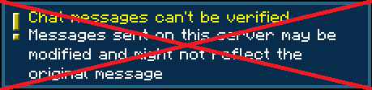

# Disable Insecure Chat Toast

This client-side mod deletes the warning toast about connecting to a server without enforced secure chat.

There is nothing to configure — install it and the toast is gone.

Available for Fabric and NeoForge on Minecraft 26.1+.

[CurseForge](https://www.curseforge.com/minecraft/mc-mods/disable-insecure-chat-toast)  
[Modrinth](https://modrinth.com/mod/disableinsecurechattoast)  
[Discord](https://discord.gg/UY4nhvUzaK)